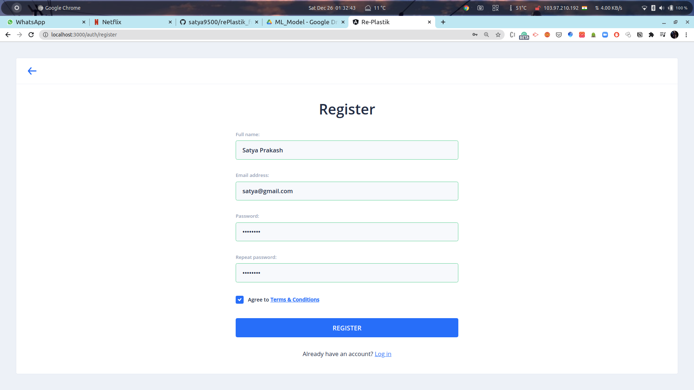
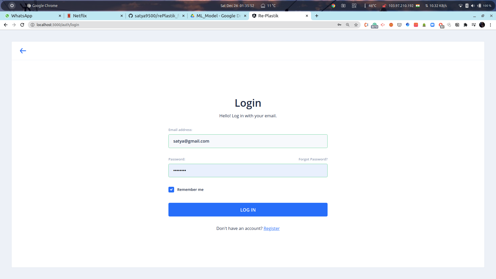
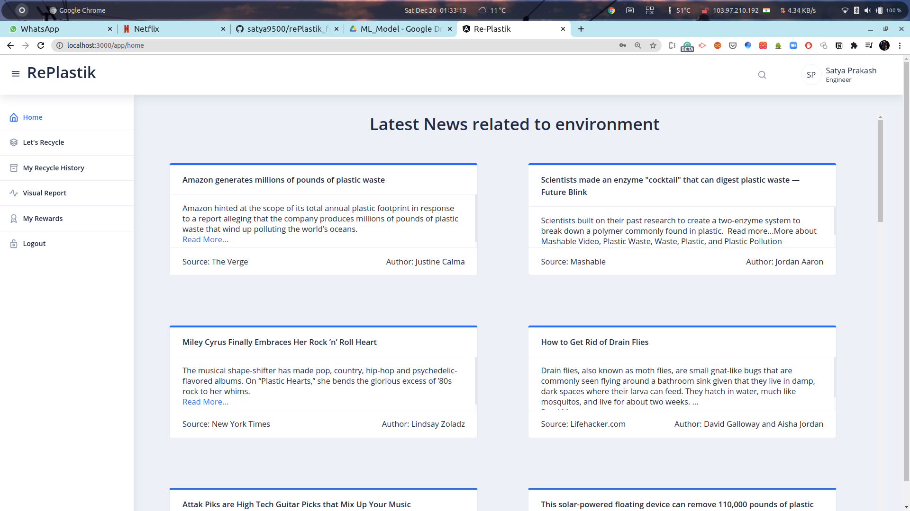
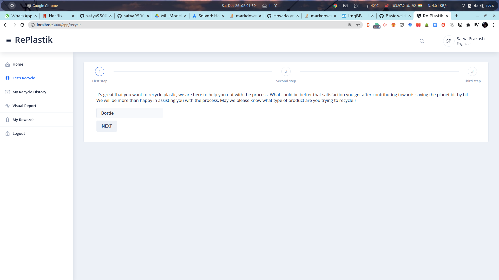
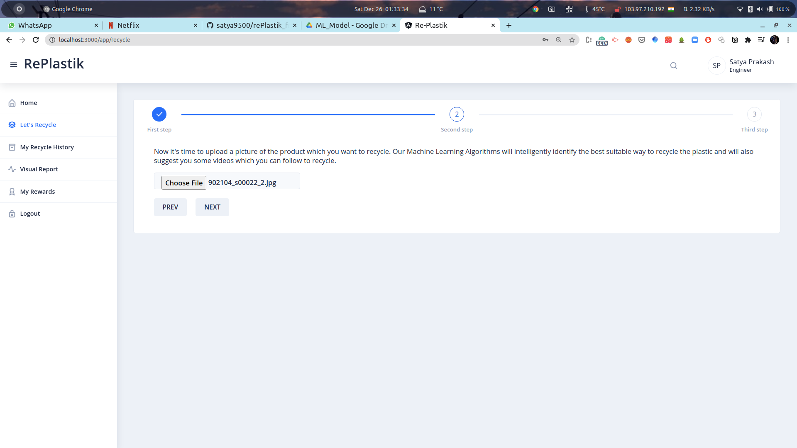
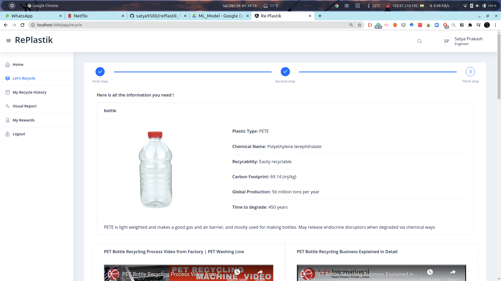
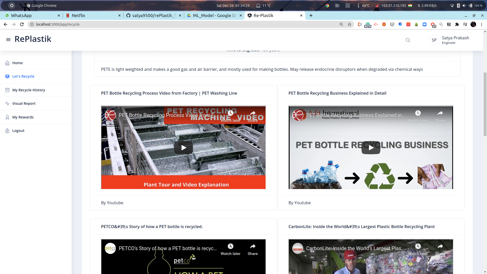
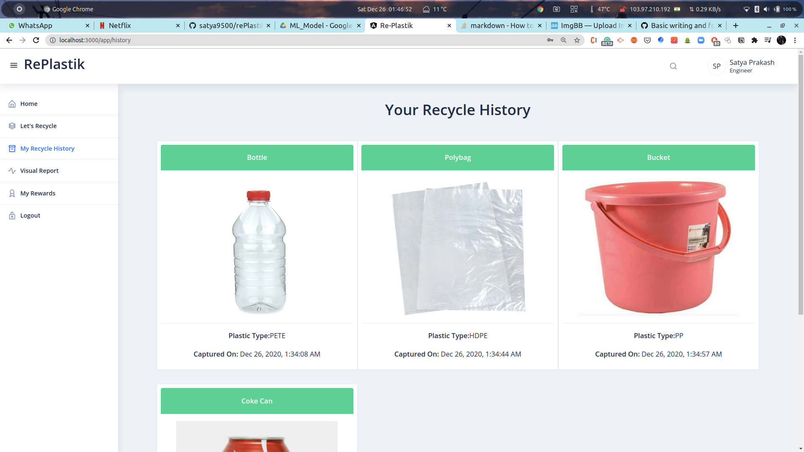
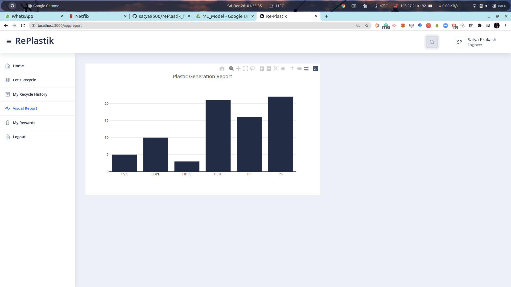
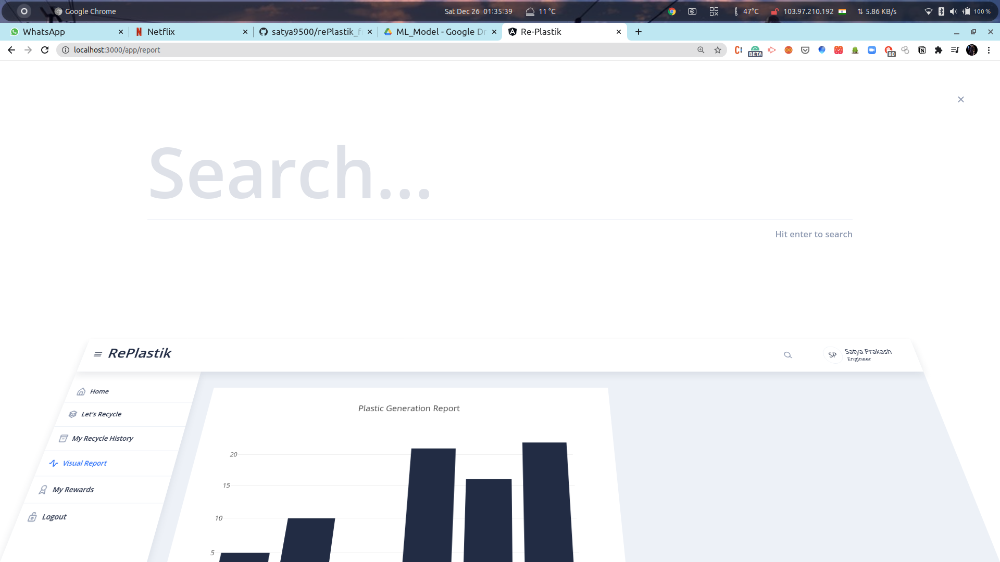

# RePlastik
This project classifies types of plastics ad gives insights about the same to the users.
Also suggests recycling/reusing process after analyzing the plastic.
Generates Visual reports using plotly.

[Backend of this project](https://github.com/satya9500/rePlastik_backend)

[ML Models for this project](https://github.com/satya9500/rePlastik_ML)

## Tech Stack
1. Frontend - Angular 
2. UI Component Library - [Nebular](https://akveo.github.io/nebular/docs/getting-started/what-is-nebular#what-is-nebular)
3. Graphs - PlotlyJS
4. Backend - NodeJS
5. DB - MongoDB
6. ML Models and APIs - Flask and fastai

## Screenshots

### Registration Page
 

### Login Page
 

### Home Page
 

### Classification Steps

**First**
 

**Second**

**Third**
 
 

### Classification History

### Visual Report

### Search Page

#### How to run 
**Make sure you have Angular 10 installed and flask + nodejs backend are running**
1. `git clone https://github.com/satya9500/rePlastik_frontend.git`
2. `cd rePlastik_frontend`
3. `npm i`
4. `ng serve --proxy-config proxy.conf.json`

